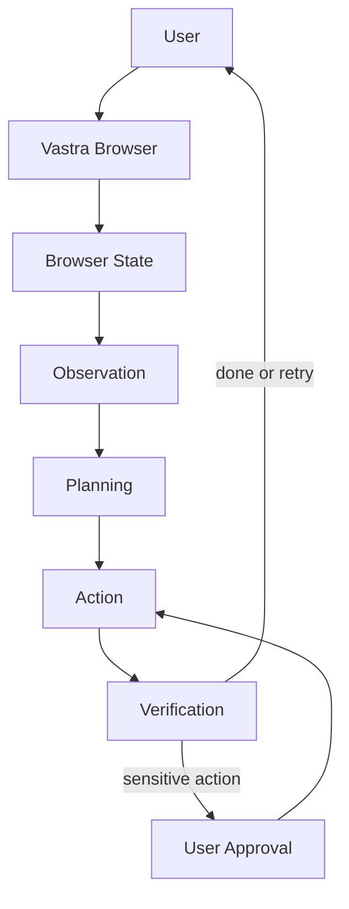
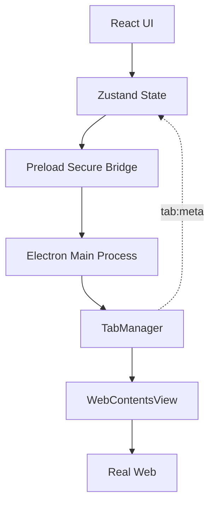
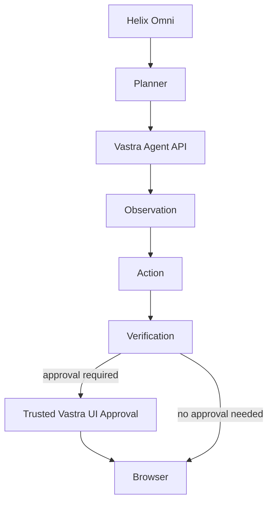

<div align="center">

<!-- Optional: replace with your own local asset once you add it -->
<!--  -->

# Vastra — Browse Beyond

**An open-source desktop browser for calm, focused browsing — with an agent-native control layer built in.**

<a href="https://github.com/Akira-official/vastra-browser">
  
</a>

<br />


<br />

[**Overview**](#what-is-vastra) ·
[**Features**](#features) ·
[**AI-Native**](#ai-native-by-architecture) ·
[**Helix Omni**](#helix-omni) ·
[**Agent OS API**](#vastra-agent-os-api) ·
[**MCP**](#model-context-protocol-mcp) ·
[**Architecture**](#architecture) ·
[**Quick Start**](#quick-start) ·
[**Contributing**](#contributing)

</div>

---

## Table of Contents

- [What is Vastra?](#what-is-vastra)
- [Why Vastra?](#why-vastra)
- [Features](#features)
- [AI-Native by Architecture](#ai-native-by-architecture)
- [Helix Omni](#helix-omni)
- [Vastra Agent OS API](#vastra-agent-os-api)
- [Command Catalog](#command-catalog)
- [Model Context Protocol (MCP)](#model-context-protocol-mcp)
- [Security & Trust Model](#security--trust-model)
- [Architecture](#architecture)
- [Tech Stack](#tech-stack)
- [Project Structure](#project-structure)
- [Quick Start](#quick-start)
- [Development](#development)
- [Production Packaging](#production-packaging)
- [Default Browser Integration](#default-browser-integration)
- [Testing & Benchmarks](#testing--benchmarks)
- [Privacy](#privacy)
- [Current Status](#current-status)
- [Version Evolution](#version-evolution)
- [Roadmap](#roadmap)
- [Contributing](#contributing)
- [Bug Reports](#bug-reports)
- [License](#license)
- [Credits](#credits)
- [Assets to Add](#assets-to-add)

---

## What is Vastra?

Vastra is a desktop browser built with Electron, React and Vite. It renders real websites, keeps your tabs organised in workspaces, and ships with the everyday tools a browser needs: bookmarks, history, downloads, find-in-page, zoom, a command palette, themes and a home dashboard.

It is also designed as an **AI-native browser**. Instead of bolting a chatbot onto the side, Vastra exposes structured browser state (tabs, page observations, interactive elements, approvals) and a verified command API. That is the surface **Helix Omni**, the built-in agent, works through, and the same surface is available to external agents over REST and MCP.

**Who is it for?**

- **Everyday users** who want a calm, minimal browser with workspaces, a clean home page and an assistant that only reads the pages they choose to share.
- **Developers and agent builders** who want a real browser they can observe and control programmatically, with stable tab IDs, snapshot preconditions, explicit errors and approval gates.

**Why does it exist?** Most browser automation treats the browser as a black box behind screenshots and selectors. Vastra treats it as an application with a defined contract: observe, act, verify, and ask the user when an action has meaningful side effects.

> [!NOTE]
> Vastra is a usable normal browser first. Everything AI-related is opt-in and configured by you (your own provider and API key).

<div align="center">

<!-- Add docs/assets/vastra-demo.gif, then uncomment: -->
<!--  -->

*Demo GIF placeholder: `docs/assets/vastra-demo.gif` (see [Assets to Add](#assets-to-add))*

</div>

---

## Why Vastra?

<table>
  <tr>
    <td width="25%" valign="top">
      <h3>🧘 Calm browsing</h3>
      Warm, minimal UI with light/dark themes, accent colors and density controls.
    </td>
    <td width="25%" valign="top">
      <h3>🗂️ Workspaces</h3>
      Each workspace has its own emoji and color identity and owns its own tabs.
    </td>
    <td width="25%" valign="top">
      <h3>⚡ Fast interaction</h3>
      Command palette, a central shortcut engine, and a full set of familiar browser shortcuts.
    </td>
    <td width="25%" valign="top">
      <h3>🤖 AI-native</h3>
      Helix Omni plans against a live command catalog through the same API external agents use.
    </td>
  </tr>
  <tr>
    <td valign="top">
      <h3>🔐 Approval-aware</h3>
      Actions with meaningful side effects pause for <b>Approve once</b> or <b>Deny</b>.
    </td>
    <td valign="top">
      <h3>🧠 Grounded context</h3>
      Answers use bounded visible page text, headings, metadata and content type, not URL guesses.
    </td>
    <td valign="top">
      <h3>🧩 Open architecture</h3>
      React renderer, Electron main process, preload bridge and a tab manager you can read and extend.
    </td>
    <td valign="top">
      <h3>🛠️ Developer control</h3>
      REST discovery, session contract, MCP tools, stable IDs and explicit error codes.
    </td>
  </tr>
</table>

---

## Features

### Browsing

| Feature | Details |
| --- | --- |
| Multi-tab browsing | Per-workspace tabs; vertical tab list in the sidebar **and** a horizontal tab strip |
| Real web rendering | Electron `WebContentsView` (no iframes); internal pages (`vastra://home`, etc.) render in React |
| URL vs search detection | Explicit scheme, `localhost`, IPv4/IPv6 or `host.tld` open as URLs; everything else goes to your search engine |
| Search engines | Google (default), DuckDuckGo, Bing, Brave, Startpage via *Settings → Search Engine* |
| Navigation | Back / forward / reload |
| Zoom | `Ctrl` + `+` / `-` / `0` on the active web tab |
| Find in page | `Ctrl+F` with previous/next, match counter, `Esc` to close |
| Real downloads | Live progress (~5 fps), smoothed speed, pause / resume / cancel, open file / open folder, state persists across launches |
| Dynamic favicons | Live multi-source lookup with caching and a generated fallback tile |
| Keyboard shortcuts | One central shortcut engine, see the [table below](#keyboard-shortcuts) |

### Workspaces

- Persistent workspaces with emoji and color identity (for example Personal, Design Studio, Marketing Team).
- Switch through the workspace rail; each workspace owns its own tabs.
- Closed tabs restore into the workspace they were closed from.
- Normal workspaces share one durable browser profile. Incognito remains isolated.

### Productivity

- **Command palette** (`Ctrl/Cmd+K`): quick actions, search suggestions, fuzzy match over bookmarks and history, keyboard navigation.
- **Home dashboard:** greeting, search, quick links grid, top sites, weather, focus timer, notes, productivity list, recent activity.
- **Notes:** list plus editor pane.
- **Focus timer**, **Quick Shortcuts** (Add/Edit, live icon preview, URL validation) and a **notification center** with filter chips.
- **Top Sites:** top 6, sorted by pinned, then visits, then recency. Hover to pin, unpin or hide.

### Browser data

| Data | Behavior |
| --- | --- |
| Bookmarks | Star button in the URL bar toggles the current tab; folders, pinned grid, all bookmarks, reading list |
| History | Recorded on every web tab's `did-stop-loading`; grouped by day; per-host visit counters |
| Downloads | Active and completed states, file-type icons, progress bars, top-right popover |
| Recently closed tabs | Every closed web tab is captured; `Ctrl+Shift+T` reopens it |

Bookmarks, history, downloads, notifications, recently closed tabs and host stats start empty; pages render empty states instead of seed data.

### Customization

- Light and dark themes via CSS variables; `system` mode follows `prefers-color-scheme`.
- 8 accent colors: orange, rose, amber, emerald, sky, violet, indigo, slate.
- Density and toolbar style, with a live preview in *Settings → Appearance*.
- Framer Motion drives sidebar collapse, tab transitions, palette open, route changes and hover/press states.

### Keyboard shortcuts

<details>
<summary><b>Show the full shortcut map</b></summary>

<br />

| Shortcut | Action |
| --- | --- |
| `Ctrl+T` | New tab |
| `Ctrl+W` | Close tab |
| `Ctrl+Shift+T` | Reopen closed tab |
| `Ctrl+Tab` / `Ctrl+Shift+Tab` | Next / previous tab |
| `Ctrl+1` … `Ctrl+8` | Jump to tab N |
| `Alt+Left` / `Alt+Right` | Back / Forward |
| `Ctrl+L` | Focus URL bar |
| `Ctrl+R` / `F5` | Reload |
| `Ctrl+K` | Command palette |
| `Ctrl+F` | Find in page |
| `Ctrl++` / `Ctrl+-` / `Ctrl+0` | Zoom in / out / reset |
| `Ctrl+H` | History page |
| `Ctrl+J` | Downloads page |
| `Ctrl+D` | Bookmark active tab (toggle) |
| `Ctrl+B` | Toggle sidebar |
| `F11` | Toggle fullscreen |
| `Esc` | Close any open overlay |

A single `ShortcutsProvider` (`src/shortcuts/index.jsx`) owns one window-level `keydown` listener. Modifier combos fire even while typing; bare keys defer to inputs. Adding a shortcut is one line in `useShortcutMap()`.

</details>

### AI

Helix Omni, grounded page understanding, cross-tab context, page/PDF/video understanding, research, forms, reliable interaction, extraction, navigation, diagnostics, visual/scrolling work, background research lanes and model lanes. Details in [Helix Omni](#helix-omni).

### Automation

Agent REST API, Browser Operating System API, MCP wrapper, semantic locators, Shadow DOM piercing, fuzzy element recovery, auto-scroll, obstruction detection, batch execution, form autofill, snapshot IDs, stale-snapshot detection and approval boundaries. Details in [Vastra Agent OS API](#vastra-agent-os-api).

---

## AI-Native by Architecture

Helix is not a chat panel that guesses from a URL. It works through a loop that the browser itself supports.



**What the browser exposes to an agent**

| Signal | What it contains |
| --- | --- |
| Page observation | Unified snapshot with active page state and tabs |
| Accessibility information | Accessibility tree, focus |
| Interactive elements | Locatable elements, including `obstructed` status and `select` option lists |
| Stable tab IDs | Address any agent-owned tab without changing the user's active tab |
| Screenshots | Per-tab capture, including background tabs |
| Page content | Bounded visible text, headings, language, canonical URL, description, detected content type (v1.5.0) |
| Obstacles | Login, MFA, captcha, rate-limit, access-block, paywall and cookie-dialog detection |
| Approvals | Pending sensitive actions awaiting a trusted user decision |
| Action results | Structured results with stable error codes, retryability and recovery suggestions |
| Verification | The planner audits the visible effect of an action before accepting completion |

If an action reports success but the browser did not change, the planner is forced into changed-strategy recovery instead of trusting the report.

---

## Helix Omni

**Helix Omni** is the built-in agent in Vastra's side panel. Its settings identify the selected provider and underlying model accurately rather than renaming the model. Helix identifies its real configured providers; it does not claim that Claude, GPT, Gmail, Calendar or any other service is connected unless a tool result proves that access.

### Providers

- Google Gemini
- Local or hosted OpenAI-compatible servers such as **LM Studio**, **Ollama** and **vLLM**

### Runtime (v1.3.1)

A bounded **observe → plan → act → recover → verify** loop with adaptive page detail, visible-control prioritization, compact planner context, automatic malformed-plan repair and up to three changed-strategy recovery attempts. It can run up to four safe, independent reads or tab operations concurrently; dependent actions stay sequential and verified. A deterministic instant mode handles multi-site opens, semantic clicks/types, tab control, page text, headings and links without waiting for a reasoning model.

### Capability timeline

<details open>
<summary><b>Focused skills for smaller models (v1.4.0)</b></summary>

<br />

Helix routes each goal into one or two internal skills: **Research**, **Forms**, **Reliable Interaction**, **Extraction**, **Tabs & Navigation**, **Files**, **Media**, **Browser Data**, **Diagnostics** or **Visual & Scrolling**. Each skill provides a short recipe and exact JSON examples for its preferred, verified tools. The active skill is shown in the side panel.

This replaces the earlier flat 492-command prompt with a goal-specific prompt that keeps the full live catalog available but exposes the most relevant subset up front. With the 513-command catalog of that release, measured skill prompts were about 5.2–5.9K characters (roughly 1.3–1.5K tokens) for common research, form, diagnostics and navigation goals. The design intent is better reliability for 7B–10B class local instruction models without shrinking the command surface.

The planner also repairs common small-model output locally: Markdown JSON, smart quotes, trailing commas, bare keys, Python booleans, single-quoted values, OpenAI-style `tool_calls`, direct `command({...})` syntax, underscore/case command variants, stringified arguments and frequent argument aliases. Sensitive actions still go through the same client and server approval policies after normalization.

</details>

<details>
<summary><b>Dependency-aware quick workflows (v1.4.3)</b></summary>

<br />

Quick mode recognizes compound requests such as "open YouTube and play the latest video by …" as an ordered workflow. It opens an upload-date-sorted search, carries the created stable tab ID through every dependent step, waits for hydrated results, selects a real non-sponsored `/watch?v=` result, waits for the media element, starts playback and verifies the player is not paused. Authentication, CAPTCHA, permissions, external submissions, payments and other sensitive operations keep their handoff or approval boundaries.

</details>

<details>
<summary><b>Model lanes and visual background work (v1.4.4)</b></summary>

<br />

Work is split between two lanes:

| Lane | Model | Role |
| --- | --- | --- |
| Reasoning | `gemma-4-31b-it` | Official reasoning model |
| Fast planner / vision | `gemini-3.5-flash-lite` | Fast planning and visual understanding |

Planner history is bounded before every request so one page cannot consume the reasoning model's rolling input-token window. If that model returns a token-window `429`, Helix classifies it, reads the retry interval, and continues the turn on the fast lane instead of surfacing an opaque quota error. The AI settings panel exposes all three model roles and includes a live connection test.

Smart-mode tabs are agent-owned and backgrounded by default. Helix keeps their stable IDs, observes each research lane without activating it, captures per-tab screenshots for visual planning or recovery, and can run independent source opens and reads in parallel before synthesizing observed evidence. Your visible tab and input focus stay untouched unless the task explicitly requires a foreground action.

</details>

<details>
<summary><b>Grounded browser copilot (v1.5.0)</b></summary>

<br />

- **Grounded answers:** page explanation, rewriting, translation, study help, coding help, shopping comparisons and open-tab synthesis use real page content by default.
- **Cross-tab research:** goals can inspect up to ten open web tabs by stable ID without activating them.
- **Independent check:** for important verification goals, the candidate answer plus the latest evidence goes to the other configured model for a correction pass.
- **Media understanding:** metadata, captions/transcript extraction and chapter/timestamp extraction.
- **PDF analysis:** fetches bounded public documents and extracts page-numbered text and metadata with PDF.js.
- **Memory:** recent conversation context is carried; project preferences or facts are stored only after an explicit "remember" request.
- **Persistent monitors:** watch public pages for changes, matching text, a price threshold or availability. Creation and deletion require approval, results appear in Vastra notifications, and URLs that target local/private networks or embed credentials are rejected.

</details>

<details>
<summary><b>Clean answers and shared context (v1.6.0)</b></summary>

<br />

- Replies render safe Markdown (headings, bold, lists, links, tables, code); raw planner/tool chatter is kept out of the answer.
- Collapsible plain-language activity summary, copy, read-aloud and voice typing.
- You explicitly choose up to 10 pages Helix may read. Unshared page content and tab metadata are excluded from model context.

</details>

<div align="center">

<!--  -->
*Demo GIF placeholder: `docs/assets/helix-demo.gif`*

</div>

---

## Vastra Agent OS API

Vastra exposes a verified **Browser Operating System API** so local and remote AI agents (like Helix) can see and control the browser. Implemented commands return real results. Unsupported namespaces fail explicitly instead of returning placeholder success data.

All routes require the bearer token written to `~/.vastra-agent.json`, which also holds the active REST port.

### Endpoints

| Method | Endpoint | Purpose |
| --- | --- | --- |
| `GET` | `/api/v1/capabilities` | Every implemented command and its risk policy |
| `GET` | `/api/v1/session` | Versioned transport contract, endpoint map, readiness and feature flags |
| `GET` | `/api/v1/observe` | Unified browser snapshot: active page, tabs, accessibility tree, interactive elements, focus, downloads, console messages, dialogs, obstacles, pending approvals. Pass `id=<stable-tab-id>` to inspect an agent-owned background tab |
| `GET` | `/api/v1/approvals` | Pending sensitive actions |
| `POST` | `/api/v1/action` | Execute a supported command. Sensitive actions return `APPROVAL_REQUIRED` with an approval ID |
| `POST` | `/api/v1/batch` | Run sequential actions; stops honestly at the first failure or approval boundary |

### Contract highlights

- **Stable tab IDs:** create agent-owned tabs in the background, address them by ID, observe and capture them without touching the user's active tab (v1.4.2).
- **Snapshot IDs:** every observation has one. State-changing actions can carry it as a precondition; a stale client gets a structured `STALE_SNAPSHOT` response with retry guidance instead of clicking an outdated target.
- **Explicit errors:** stable codes, retryability and recovery suggestions.
- **Approval flow:** a trusted Vastra UI must approve a sensitive action before the exact command can be retried with its approval ID.
- **Honest batching:** nested grouped actions cannot bypass the server's approval policy.

```bash
# The flow, conceptually
GET  /api/v1/session        # discover the contract and readiness
GET  /api/v1/observe        # get a snapshot (with a snapshot ID)
POST /api/v1/action         # act, attaching the snapshot ID as a precondition
                            # -> APPROVAL_REQUIRED + approval ID for sensitive actions
GET  /api/v1/observe        # verify the visible effect
```

### Automation capabilities

| Capability | What it does |
| --- | --- |
| Recursive Shadow DOM piercing | Locators and observe selectors (CSS, text, role, label, placeholder) pierce `#shadow-root` boundaries recursively |
| Fuzzy self-healing element memory | Elements are cached with a fingerprint (XPath, tag, aria-role, placeholders, attributes); if a node vanishes or shifts during dynamic updates, Vastra fuzzy-reacquires it |
| Auto-scroll alignment | Click, type and clear scroll targets into view before computing coordinates |
| Obstruction and dropdown diagnostics | Observations report `obstructed: true/false` via center-point `elementFromPoint` scans and extract `select` options |
| Semantic form autofill | `forms.autofill` fills multiple inputs, selects and textareas in one round-trip |
| Batch execution | `batch.execute` runs sequential actions in a fast server-side loop |
| Adaptive observe | `observe?screenshot=false&detail=fast` gives routine turns a prioritized semantic snapshot and escalates recovery turns to full accessibility/network inspection |
| WhatsApp Web messaging | Automates contact search, thread click and message entry. Background throttling is disabled while the Agent API is enabled so WhatsApp Web sync stays active when Vastra is minimized |

### Command Catalog

Vastra publishes a machine-readable command catalog at `GET /api/v1/capabilities`. The size of that surface has grown across releases, and the README documents three generations:

| Generation | Where it appears |
| --- | --- |
| 492 commands | The earlier flat command prompt that v1.4.0 replaced with goal-specific skill prompts |
| 513 commands | The catalog at v1.4.0 when skill prompts were measured |
| **525 commands across 48 namespaces** | The current catalog as stated in the source README |

Clients should always read `/api/v1/capabilities` instead of assuming an action exists. Internal tracing/orchestration controls and app-terminating operations stay unavailable to models.

---

## Model Context Protocol (MCP)

Vastra provides an MCP server (`mcp-server.cjs`) implemented as a **stdio JSON-RPC 2.0** wrapper. MCP clients such as Claude Desktop or Cursor can run Vastra tools natively.

**How it connects:** when Vastra starts, it writes the active REST port and bearer token to `~/.vastra-agent.json`. `mcp-server.cjs` reads that file on startup, so no manual token setup is needed.

### Claude Desktop configuration

Add this to your `claude_desktop_config.json` and point `args` at your local copy of `mcp-server.cjs`:

```json
{
  "mcpServers": {
    "vastra-browser": {
      "command": "node",
      "args": ["YOUR_PATH_HERE/mcp-server.cjs"]
    }
  }
}
```

> [!TIP]
> The original documentation example used a Windows-style path. Use the absolute path to `mcp-server.cjs` on your machine. Never paste tokens into MCP config; the wrapper reads them from `~/.vastra-agent.json`.

### Exposed tools

| # | Tool | Description |
| --- | --- | --- |
| 1 | `observe` | Active page title, URL, interactive elements, optional base64 screenshot |
| 2 | `tab_list` | Tabs with stable IDs and loading state |
| 3 | `tab_create` | Opens a tab and waits for its web view to exist |
| 4 | `navigation_go` | Navigates a specific tab to a URL |
| 5 | `locator_find` | Resolves query selectors (pierces Shadow DOM) |
| 6 | `element_click` | Auto-scrolls and clicks an interactive element |
| 7 | `element_type` | Focuses and types keyboard input |
| 8 | `whatsapp_send_message` | Native WhatsApp message sender |
| 9 | `forms_autofill` | Fills multiple form elements semantically |
| 10 | `batch_execute` | Runs multiple commands sequentially on the server |
| 11 | `page_get_text` | Reads visible page text from a tab |
| 12 | `custom_action` | Reaches other implemented commands (clipboard, history, windowing, bookmarks, scrolling); unsupported commands return an explicit error |
| 13 | `get_capabilities` | Live command catalog and risk policy for tool discovery |
| 14 | `get_pending_approvals` | Actions waiting for a trusted user decision |

---

## Security & Trust Model

Vastra's approach is to make boundaries explicit and enforce them on the server, not to promise that nothing can go wrong.

| Area | Current behavior |
| --- | --- |
| Agent API auth | All routes require a bearer token from `~/.vastra-agent.json` |
| Sensitive actions | Return `APPROVAL_REQUIRED` with an approval ID; only the trusted Vastra UI can grant approval. External REST and MCP clients can request, not approve |
| Approval UX | Helix pauses side-effect actions for **Approve once** or **Deny** |
| Risk policies | Published per command via `/api/v1/capabilities` |
| Untrusted web content | The built-in planner fences website-authored content as untrusted data |
| Stale state | Snapshot ID preconditions produce `STALE_SNAPSHOT` instead of acting on an outdated target |
| No fake success | Unsupported commands are rejected; no placeholder success for future areas such as full DevTools Protocol emulation or extension installation |
| Loop protection | Repeated-action loops are stopped automatically |
| Model restrictions | Internal tracing/orchestration controls and app-terminating operations are unavailable to models |
| Credentials | Provider secrets are encrypted through the OS credential store; API keys are never bundled into an installer |
| Handoffs | Login, CAPTCHA, MFA, payments, submissions, permissions and destructive actions keep handoff or approval gates. Automation does not disable browser security |
| Persistent monitors | Creation/deletion need approval; URLs targeting local/private networks or embedding credentials are rejected |
| Archive extraction | Bounded extractor rejects traversal, absolute and Windows-ambiguous paths, symlinks, special files, duplicate destinations and oversized / decompression-bomb archives. The vulnerable `extract-zip` package is no longer used, and the production dependency audit was reported clean in v1.5.0 |
| Password manager | Local, encrypted, with a user-approved save prompt after login (v1.6.0) |

> [!IMPORTANT]
> This describes the current implementation, not a security certification. Review the code and report vulnerabilities responsibly.

---

## Architecture

### Browser core



- The renderer keeps the **source of truth** for tabs in Zustand.
- The main process keeps a `TabManager` that lazily creates one `WebContentsView` per web tab and positions it over the React viewport.
- The renderer asks main to `create / activate / close` tabs, `loadUrl / back / forward / reload`, and `setBounds(rect)`. `ViewportHost` measures itself with a `ResizeObserver` and pushes the rect.
- Main pushes `title`, `favicon`, `loading`, `canGoBack`, `canGoForward` and `url` back over `tab:meta`.
- When the active tab is an internal page, main **hides** the `WebContentsView`; for a web URL it shows and aligns it.

### Agent path



External clients (MCP, REST) enter at the **Vastra Agent API** and go through the same approval policy as Helix.

---

## Tech Stack

| Technology | Version | Purpose |
| --- | --- | --- |
| Electron | 33 | Desktop shell; `WebContentsView` for real web tabs |
| React | 18 | Renderer UI and internal pages |
| Vite | 5 | Dev server and renderer build |
| Tailwind CSS | 3 | Styling with CSS-variable theming |
| Framer Motion | 11 | UI animations |
| Zustand | 4 | Renderer state stores |
| Lucide React | — | Icons |
| Inter + Instrument Serif | — | Type pair |

---

## Project Structure

```text
vastra-browser/
├── electron/
│   ├── main/index.cjs          # main process: window + TabManager (WebContentsView)
│   ├── preload/index.cjs       # secure bridge -> window.vastra.{app,window,tabs}
│   └── ipc/                    # reserved for future IPC modules
│
├── src/
│   ├── App.jsx                 # shell, routing, lifecycle reconciliation
│   ├── main.jsx                # React entry
│   ├── layouts/                # BrowserShell, ViewportHost
│   ├── components/             # ui, sidebar, topbar, overlays, widgets
│   ├── pages/                  # Home, Bookmarks, History, Downloads, Extensions,
│   │                           # Settings, Workspaces, Tabs, Notes
│   ├── store/                  # Zustand stores (tabs, workspaces, theme, ui,
│   │                           # bookmarks, history, downloads, notifications, persist)
│   ├── hooks/useHotkeys.js
│   ├── utils/cn.js
│   ├── styles/globals.css      # Tailwind + CSS variables
│   └── assets/
│
├── tailwind.config.js
├── vite.config.js
├── postcss.config.js
├── index.html
└── package.json
```

| Area | Role |
| --- | --- |
| `electron/` | Main process, `TabManager`, preload bridge |
| `src/layouts/` | `BrowserShell` (Sidebar + TopBar + viewport) and `ViewportHost` (reports bounds to Electron, swaps page and web view) |
| `src/components/` | `ui` primitives, `sidebar`, `topbar`, `overlays` (command palette, notifications, profile), `widgets` (home dashboard) |
| `src/pages/` | Internal `vastra://` pages |
| `src/store/` | Zustand stores; `persist.js` writes pickable slices to `localStorage` |
| `src/hooks/`, `src/utils/`, `src/styles/`, `src/assets/` | Hotkeys, helpers, global styles, static assets |

> The tree above reflects the layout documented in the original README. Newer modules (for example `src/shortcuts/`, `src/utils/url.js`, `src/utils/favicon.js`, `mcp-server.cjs`) are referenced elsewhere in the project docs.

---

## Quick Start

```bash
git clone https://github.com/Akira-official/vastra-browser.git
cd vastra-browser
npm install
npm run dev
```

`npm run dev` starts Vite on `:5173` and launches Electron as soon as Vite is ready.

| Command | What it does |
| --- | --- |
| `npm run dev` | Vite + Electron together, hot reload for the renderer |
| `npm run dev:vite` | Vite only at <http://localhost:5173>, useful for designing in a browser tab |
| `npm run build` | Builds the renderer to `dist/` |
| `npm start` | Runs Electron against a built `dist/` |
| `npm run package` | Builds a standalone `Vastra-win32-x64/` folder under `dist-app/`; run `Vastra.exe`, no install needed |
| `npm run dist:win` | Runs the release checks, then produces a Windows installer and unpacked executable in `dist-installer/`; reuses the installed Electron runtime to avoid Windows archive-lock failures |
| `npm run dist:mac` | macOS build (`.dmg`); must run on macOS |
| `npm run dist:linux` | Linux build (`.AppImage`, `.deb`); must run on Linux |

> [!NOTE]
> Real website browsing only works inside Electron, not in `dev:vite` alone. No Node.js version is documented in the source; use a current version compatible with Electron 33 tooling.

---

## Development

Understand these pieces before contributing:

| Piece | What to know |
| --- | --- |
| React renderer | Owns UI and the source of truth for tabs (Zustand) |
| Electron main | Window lifecycle, `TabManager`, download manager, protocol handling, logging |
| Preload bridge | The secure boundary exposing `window.vastra.{app,window,tabs}` |
| `WebContentsView` | One per web tab, created lazily, positioned over the React viewport |
| IPC | Renderer requests (`create/activate/close`, `loadUrl`, `setBounds`) and main pushes (`tab:meta`, `default:status`) |
| Internal pages | React components (`vastra://home`, etc.), main hides the web view while they are active |
| Real websites | Render only in Electron |
| `app://` scheme | Production renderer origin (see [Production Packaging](#production-packaging)) |
| Persistence | `persist.js` subscribes to Zustand stores and writes slices to `localStorage`, loaded synchronously on first import |
| Logging | `%APPDATA%/vastra-browser/vastra-main.log` on Windows |

**Dev vs packaged:** in dev, the renderer is served by Vite on `:5173`. In a packaged build, it loads from `app://./index.html`, and file paths (dist root, preload, icon) must be resolved across dev, ASAR-packed and unpacked layouts.

**Adding a shortcut:** one line in `useShortcutMap()`.
**Adding a search engine:** add it to `SEARCH_ENGINES` in `searchStore.js`; the picker, normalizer and address bar pick it up automatically.

<details>
<summary><b>App icon pipeline</b></summary>

<br />

The Vastra mark lives at the project root as `app_icon.png` (1024×1024) and flows through one pipeline: `build/icon.png`, then `node build/make-ico.cjs` (multi-resolution ICO: 16/24/32/48/64/128/256 via `png-to-ico`), then `electron/icon.{png,ico}` (ships inside `app.asar`), and `public/app-icon.png` (used by the renderer's `AppIcon` component).

If you swap the source PNG:

```bash
cp app_icon.png build/icon.png && cp app_icon.png electron/icon.png && cp app_icon.png public/app-icon.png && node build/make-ico.cjs
```

</details>

---

## Production Packaging

Packaged Electron apps fail silently in specific ways. Vastra handles each explicitly.

| Problem | Vastra's fix |
| --- | --- |
| Vite emits `<script type="module" crossorigin>`; `file://` blocks it in packaged Electron, giving a blank window | A privileged `app://` scheme is registered before `app.whenReady()` (`standard, secure, supportFetchAPI, corsEnabled, stream`). The renderer loads from `app://./index.html`, and `protocol.handle('app', …)` maps every URL to a file under `dist/` |
| `show: false` waiting on `ready-to-show` that never fires | Show on `dom-ready`, plus a 1.2 s force-show fallback timer |
| Empty cream window during JS parse on cold start | Inline `<style>` in `index.html` paints the mesh-gradient background before the bundle runs |
| Google Fonts `@import` blocking first paint | Non-blocking `<link rel="stylesheet" media="print" onload="this.media='all'">` |
| Errors invisible because Windows GUI exes have no console | Boot, lifecycle and renderer `console-message` (warn/error) events go to `%APPDATA%/vastra-browser/vastra-main.log`; `did-fail-load` and `render-process-gone` open devtools and show a dialog with the log path |
| Paths drift between dev, ASAR and unpacked | `resolveDistRoot`, `resolvePreload`, `resolveIcon` walk a candidate list and verify with `fs.existsSync` |
| Double-click spawning ghost processes | `app.requestSingleInstanceLock()`; the second launch focuses the existing window |
| Silent renderer crashes | `render-process-gone` and `preload-error` handlers log and show a dialog |
| CORS blocking on `file://` | The `app://` scheme is `corsEnabled: true` |

---

## Default Browser Integration

Taking over the OS default browser on Windows 11 takes three things.

**1. Appear in the Default Apps picker.** Vastra writes a full *Capabilities* registry tree at every launch (under `HKCU`, no admin required), pointing at the actual `Vastra.exe`:

```text
HKCU\Software\RegisteredApplications\Vastra            = Software\Vastra\Capabilities
HKCU\Software\Vastra\Capabilities\URLAssociations      = http / https / mailto -> VastraHTML
HKCU\Software\Vastra\Capabilities\FileAssociations     = .html .htm .shtml .mhtml .pdf .svg .webp -> VastraHTML
HKCU\Software\Classes\VastraHTML\shell\open\command    = "<exe>" "%1"
HKCU\Software\Classes\VastraHTML\DefaultIcon           = "<exe>",0
```

**2. The user picks Vastra.** Windows 11 does not let apps flip the choice silently. The *Set as default* button retries `setAsDefaultProtocolClient` for `http`/`https`/`mailto`/`ftp`, falls back to `ms-settings:defaultapps`, and shows a "Waiting for you to pick Vastra in Settings" state.

**3. Detect the real default.** `app.isDefaultProtocolClient('http')` only reflects registration, not user choice. Vastra reads `HKCU\Software\Microsoft\Windows\Shell\Associations\UrlAssociations\<scheme>\UserChoice\ProgId` via `reg query` and compares it with `VastraHTML`. The cache refreshes on focus and every 4 s, and changes are pushed to the renderer over `default:status` IPC.

**UI:** a first-run banner (*Set as default* → *Waiting for you to pick Vastra* → *Vastra is now your default browser*, dismissable) and **Settings → General → Default Browser** with per-protocol status pills and Set / Re-check / Open Windows settings buttons. Dismissing the banner stores `vastra.defaultBrowserDismissed=1`.

| Platform | Behavior |
| --- | --- |
| Windows 11/10 | Opens *Settings → Apps → Default apps*; detection via `UserChoice` |
| macOS | System "Use Vastra as default browser?" prompt; native traffic lights |
| Linux | Updates `xdg-mime` defaults |

Windows uses custom window controls.

---

## Testing & Benchmarks

### Real-world automation matrix (v1.4.1)

The live browser-control matrix exercises **164 checks across 45 namespaces** against real websites: YouTube playback controls, Google Docs sign-in rendering, a persistent contenteditable web notepad, Google research results and an authoritative W3C source. It is meant to catch regressions in locators, contenteditable handling, element recovery after reload, screenshot capture, CDP touch gestures, ranked search extraction, page state and action traces. It is a regression matrix, not proof of reliability on every site.

| Script | Purpose |
| --- | --- |
| `npm run test:real-world` | Repeatable live test against a running isolated Vastra Agent API |
| `npm run test:wrapper` | Native adapter test |
| `npm run test:computer-use` | Against a running Agent API |
| `npm run test:helix-live` | Helix live test |
| `npm run test:helix-youtube` | Exact YouTube compound-workflow regression |
| `npm run test:helix-content` | Real article / transcript / PDF smoke test |
| `npm run test:helix-background` | Focus-preserving multi-tab research |

For `test:real-world`, configure `VASTRA_SMOKE_BASE_URL`, `VASTRA_SMOKE_TOKEN` and optionally `VASTRA_SMOKE_LOG`. The expected version comes from `package.json` unless `VASTRA_SMOKE_EXPECTED_VERSION` is set.

### Benchmarks

> [!WARNING]
> These are measurements from specific tests and versions. They are not general performance claims.

| Benchmark | Context | Result |
| --- | --- | --- |
| Adaptive observe (`detail=fast`) | v1.3.1 Wikipedia smoke benchmark, warm median | ~15 ms / 62 KB vs ~31 ms / 302 KB for full detail |
| Grouped safe reads | v1.3.2 four-read localhost benchmark, median | 15.6 ms grouped vs 61.5 ms for four separate requests (about 3.94×) |
| Form autofill (`forms.autofill`) | Single round-trip, as documented | under 500 ms |
| Skill prompt size | v1.4.0, 513-command catalog | ~5.2–5.9K characters (~1.3–1.5K tokens) |

---

## Privacy

- Normal workspaces share one durable browser profile, preserving existing Personal-workspace logins. Incognito remains isolated.
- Only pages you explicitly share (up to 10) are included in Helix context. Unshared page content and tab metadata are excluded.
- Website-authored content is treated as untrusted data by the planner.
- Provider secrets are encrypted through the OS credential store; API keys are not bundled in installers.
- Sensitive actions require explicit approval.
- Google sign-in starts inside Vastra when supported, with a system-browser fallback only when Google rejects an embedded OAuth flow.
- Helix stores preferences or facts only after an explicit "remember" request.

Vastra makes no legal or regulatory compliance claims.

---

## Current Status

### Shipped

- Multi-tab, workspace-aware browsing on real `WebContentsView`s
- Bookmarks, history, downloads (real manager), recently closed tabs, find, zoom, sidebar collapse, fullscreen
- Command palette, notes, focus timer, quick shortcuts, top sites, notification center
- Theme engine, accent colors, density, Framer Motion animations
- Central shortcut engine
- Windows default-browser flow, production-safe `app://` packaging
- Encrypted local password manager with approved save prompt and password generation (v1.6.0)

### Experimental / AI

- Helix Omni (planner, skills, model lanes, background research, monitors, media/PDF understanding)
- Agent REST API and MCP wrapper
- Provider support: Gemini and OpenAI-compatible servers

### Deferred

Listed as deferred to Phase 2 in the MVP-era documentation (architecture ready, UI not):

- [ ] Zen-style split view (needs a parallel `WebContentsView` arrangement; `TabManager` is structured for it)
- [ ] Drag tabs between workspaces (`tab.workspaceId` already supports it; needs a DnD library)
- [ ] Private/incognito window architecture (needs a separate session partition; later notes state Incognito is isolated)
- [ ] Inline bookmark/workspace renaming (data layer exists; inline editor UI missing)
- [ ] `Ctrl+Shift+D` bookmark all tabs (store has `add`; no UI button yet)

### Future

Cloud sync, accounts and an extension marketplace are described as directions the store structure is ready for. Full DevTools Protocol emulation and extension installation are not implemented and return explicit errors through the Agent API.

**Known limitations (v1.3):**

- Tabs do not persist navigation history across restarts (only their last URL).
- Agent capabilities cover the implemented catalog, not every conceptual automation API. Use `/api/v1/capabilities`.
- External REST and MCP clients can request sensitive actions; only the trusted Vastra UI can grant approval.

---

## Version Evolution

| Version | Highlights |
| --- | --- |
| MVP v0.1 | Tabs, workspaces, dashboard, command palette, themes; real browsing via `WebContentsView` |
| v1.3.x | Agent OS API: Shadow DOM piercing, fuzzy element memory, auto-scroll, adaptive observe, form autofill, batch execution; Helix Omni observe → plan → act → recover → verify loop; approval-aware parallel reads |
| v1.4.0 | Goal-specific Helix skills for smaller models; local repair of malformed model output |
| v1.4.1 | Real-world matrix: 164 checks across 45 namespaces |
| v1.4.2 | Versioned session contract, stable tab IDs, snapshot IDs, `STALE_SNAPSHOT`, obstacle detection, untrusted-content fencing |
| v1.4.3 | Dependency-aware quick workflows (YouTube example) |
| v1.4.4 | Model lanes (reasoning + fast planner/vision), bounded planner history, `429` fallback, backgrounded research tabs |
| v1.5.0 | Grounded browser copilot: page text/headings/metadata, cross-tab synthesis, media and PDF understanding, persistent monitors, hardened archive extraction |
| v1.6.0 | Clean Markdown Helix answers, activity summary, read-aloud and voice typing, explicit shared pages (up to 10), shared durable profile, Google sign-in flow, password manager save prompt |

The command surface grew across these releases (492 → 513 → 525). See [Command Catalog](#command-catalog).

---

## Roadmap

No dates are promised. This lists only directions the project documents.

**Now**

- [x] Real browsing, workspaces, downloads, history, bookmarks
- [x] Helix Omni with grounded page understanding
- [x] Agent REST API, MCP wrapper, approval gates
- [x] Windows default-browser flow

**Next**

- [ ] Zen-style split view
- [ ] Drag tabs between workspaces
- [ ] Private/incognito window UI
- [ ] Inline bookmark/workspace renaming
- [ ] Bookmark all tabs (`Ctrl+Shift+D`)

**Exploring**

- [ ] Smart tab organization (the `group` field already exists in `tabStore`)
- [ ] Cloud sync and accounts (stores are structured for remote backing; guest session already has a `user` slot)
- [ ] Extension marketplace

---

## Contributing

1. **Fork** the repository.
2. **Clone** your fork: `git clone https://github.com/YOUR_USERNAME/vastra-browser.git`
3. **Install:** `npm install`
4. **Run:** `npm run dev`
5. **Branch:** `git checkout -b feature/your-change`
6. **Make changes** in small, focused commits.
7. **Test** what you touched, including the relevant scripts from [Testing & Benchmarks](#testing--benchmarks).
8. **Open a pull request** describing what changed and why.

**Please:**

- Keep security boundaries intact.
- Do not bypass approval gates.
- Do not introduce placeholder success responses.
- Preserve explicit errors for unsupported commands.
- Add tests for browser automation behavior.
- Document architectural changes.

---

## Bug Reports

Open an issue and include:

- Operating system and version
- Vastra version
- Steps to reproduce
- Whether it happens in `npm run dev` or a packaged build
- Agent API version (from `GET /api/v1/session`), if relevant
- Console errors and relevant log lines

On Windows the log is at `%APPDATA%/vastra-browser/vastra-main.log`.

> [!CAUTION]
> Never paste your bearer token, `~/.vastra-agent.json`, API keys or personal data into an issue. Redact them first.

---

## License

Vastra is intended to be released under the **Apache License 2.0**. Add a `LICENSE` file with the full license text to the repository root so the badge above links to something real.

---

## Credits

Built with [Electron](https://www.electronjs.org/), [React](https://react.dev/), [Vite](https://vitejs.dev/), [Tailwind CSS](https://tailwindcss.com/), [Framer Motion](https://www.framer.com/motion/), [Zustand](https://github.com/pmndrs/zustand), [Lucide](https://lucide.dev/), [PDF.js](https://mozilla.github.io/pdf.js/), and the Inter and Instrument Serif typefaces.

---

## Assets to Add

None of these files exist yet. Add them, then uncomment the matching `` tags above.

| File | Used for |
| --- | --- |
| `docs/assets/hero.gif` | Hero animation |
| `docs/assets/vastra-demo.gif` | Overall product demo |
| `docs/assets/helix-demo.gif` | Helix Omni in action |
| `docs/assets/architecture.png` | Optional static architecture image |

The animated tagline in the hero uses the public `readme-typing-svg` service. Remove that block if you prefer only repository-local assets.

---

<div align="center">

**Built to make browsing feel calm.**
**Built to make automation feel native.**
**Built to give users the final say.**

<sub>Vastra — Browse Beyond</sub>

</div>
